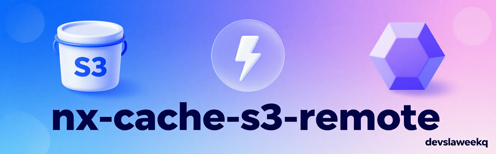

<p align="center">
  
</p>

A self-hosted [Nx remote cache](https://nx.dev/docs/guides/tasks--caching/self-hosted-caching) server backed by S3-compatible storage (built for Cloud Object Storage).

Nx's own S3 cache plugins (`@nx/s3-cache` and friends) were deprecated due to [CVE-2025-36852 (CREEP)](https://nx.dev/docs/reference/deprecated/self-hosted-cache-packages) and no longer support current Nx versions. This service implements Nx's self-hosted remote cache HTTP API directly, with one deliberate hardening the deprecated plugins lacked: **an upload for a hash that already exists is rejected with `409`** — cached artifacts are immutable once written, closing the cache-poisoning vector CREEP exploited.

**Docker image:** [`slaweekq/nx-cache-s3:latest`](https://hub.docker.com/r/slaweekq/nx-cache-s3) —
every build also pushes a `:<version>` tag matching `package.json` (e.g. `:1.2.2`), if you'd
rather pin to a specific release than track `latest`.

---

## How it works

Nx talks to this server over two endpoints ([spec](https://nx.dev/docs/guides/tasks--caching/self-hosted-caching)):

| Method | Path              | Behavior                                                        |
| ------ | ----------------- | --------------------------------------------------------------- |
| GET    | `/v1/cache/:hash` | Streams the cached artifact from S3. `404` if not found.        |
| PUT    | `/v1/cache/:hash` | Streams the upload to S3. `409` if that hash is already cached. |

Both require `Authorization: Bearer <token>`. See [`PORTS.md`](PORTS.md) for the full endpoint reference.

---

## Setup

### 1. Configure

```bash
cp .env.example .env
chmod 600 .env
```

Fill in `.env`:

```env
PORT=55100
CACHE_ACCESS_TOKEN=<generate a random secret # openssl rand -hex 32>

NXCACHE_S3_ACCESS_KEY_ID=
NXCACHE_S3_SECRET_ACCESS_KEY=
NXCACHE_S3_BUCKET=
NXCACHE_S3_REGION=
NXCACHE_S3_ENDPOINT=
NXCACHE_S3_FORCE_PATH_STYLE=true
```

The S3 bucket must already exist — this service does not create it.

### 2. Run

```bash
docker compose up -d
```

Pulls `slaweekq/nx-cache-s3:latest` and starts it on `PORT` (default `55100`).

### 3. Connect an Nx workspace

No `nx.json` changes or extra npm packages needed on the client — this is Nx core behavior
since 20.8. It's driven entirely by two environment variables, set wherever `nx` runs.

#### Local machine

Create `.env.local` in the **Nx workspace root** (e.g. `YOUR_PROJECT/.env.local` —
already gitignored by default; Nx loads it automatically for every `nx` command, no
sourcing needed):

```env
NX_SELF_HOSTED_REMOTE_CACHE_SERVER=http://localhost:55100
NX_SELF_HOSTED_REMOTE_CACHE_ACCESS_TOKEN=<same value as CACHE_ACCESS_TOKEN>
```

(Exporting both in your shell profile instead works too, if you'd rather not have a file.)

Verify it's actually being used:

```bash
npx nx reset
npx nx run <project>:<target>   # cache miss — runs for real, then uploads
npx nx reset
npx nx run <project>:<target>   # cache hit — "Nx read the output from the cache..."
```

#### GitHub Actions CI

Add both as repo **secrets** (`Settings → Secrets and variables → Actions` on the Nx
workspace's repo), then set them job-wide so every `nx` invocation in that job picks
them up:

```yaml
jobs:
  build-and-test:
    runs-on: ubuntu-24.04
    env:
      NX_SELF_HOSTED_REMOTE_CACHE_SERVER: ${{ secrets.NX_SELF_HOSTED_REMOTE_CACHE_SERVER }}
      NX_SELF_HOSTED_REMOTE_CACHE_ACCESS_TOKEN: ${{ secrets.NX_SELF_HOSTED_REMOTE_CACHE_ACCESS_TOKEN }}
    steps:
      - uses: actions/checkout@v7
      - run: npm ci
      - run: npx nx affected -t lint typecheck build test
```

Job-level `env:` is enough — no need to repeat it on every step.

---

## Run without cloning

No repo needed — pull and run the image directly.

### Quick start (one command)

```bash
docker run -d --restart unless-stopped --name nx-cache-s3 -p 55100:55100 \
  -e CACHE_ACCESS_TOKEN=<generate a random secret # openssl rand -hex 32> \
  -e NXCACHE_S3_ACCESS_KEY_ID=<your-key> \
  -e NXCACHE_S3_SECRET_ACCESS_KEY=<your-secret> \
  -e NXCACHE_S3_BUCKET=<your-bucket> \
  -e NXCACHE_S3_REGION=<your-region> \
  -e NXCACHE_S3_ENDPOINT=https://storage.yandexcloud.net \
  -e NXCACHE_S3_FORCE_PATH_STYLE=true \
  slaweekq/nx-cache-s3:latest
```

Pulls `slaweekq/nx-cache-s3:latest` automatically on first run and starts listening on
`55100`. See [Configuration reference](#configuration-reference) below for what each
variable does.

### With an env file instead

If you'd rather keep secrets in a file than inline on the command line:

```bash
mkdir -p ~/nx-cache-s3
chmod 700 ~/nx-cache-s3

cat > ~/nx-cache-s3/.env <<'EOF'
PORT=55100
CACHE_ACCESS_TOKEN=<generate a random secret # openssl rand -hex 32>

NXCACHE_S3_ACCESS_KEY_ID=
NXCACHE_S3_SECRET_ACCESS_KEY=
NXCACHE_S3_BUCKET=
NXCACHE_S3_REGION=
NXCACHE_S3_ENDPOINT=
NXCACHE_S3_FORCE_PATH_STYLE=true
EOF
chmod 600 ~/nx-cache-s3/.env

docker run -d --restart unless-stopped --name nx-cache-s3 \
  --env-file ~/nx-cache-s3/.env \
  -p 55100:55100 \
  slaweekq/nx-cache-s3:latest
```

---

## Configuration reference

| Variable                       | Required | Description                                                               |
| ------------------------------ | -------- | ------------------------------------------------------------------------- |
| `PORT`                         | No       | Listen port (default `55100`)                                             |
| `CACHE_ACCESS_TOKEN`           | Yes      | Bearer token clients must present(openssl rand -hex 32)                   |
| `NXCACHE_S3_ACCESS_KEY_ID`     | Yes      | S3 access key                                                             |
| `NXCACHE_S3_SECRET_ACCESS_KEY` | Yes      | S3 secret key                                                             |
| `NXCACHE_S3_BUCKET`            | Yes      | Bucket name (must already exist)                                          |
| `NXCACHE_S3_REGION`            | Yes      | S3 region                                                                 |
| `NXCACHE_S3_ENDPOINT`          | No       | Custom endpoint for S3-compatible providers                               |
| `NXCACHE_S3_FORCE_PATH_STYLE`  | No       | Path-style bucket URLs; `true` by default (needed for Yandex)             |
| `MAX_UPLOAD_BYTES`             | No       | Reject uploads larger than this (default `524288000`, 500 MiB) with `413` |

See [`.env.example`](.env.example) for the full template.

---

<details>
<summary>For maintainers</summary>

```bash
npm run dev       # local dev server (nodemon, live-reload)
npm run typecheck # type-check without emitting
npm test          # run the test suite (node:test, no S3 required — store is mocked)
npm run build     # build slaweekq/nx-cache-s3:latest locally
npm run push      # build and push to Docker Hub
```

See [`scripts/docker/build.sh`](scripts/docker/build.sh) and [`scripts/docker/push.sh`](scripts/docker/push.sh).
[`.github/workflows/ci.yml`](.github/workflows/ci.yml) runs typecheck + tests on every push/PR;
[`.github/workflows/docker-publish.yml`](.github/workflows/docker-publish.yml) auto-builds and
pushes the image on changes to `Dockerfile`/`package.json`/`src/**` on `main`/`master`.

</details>
